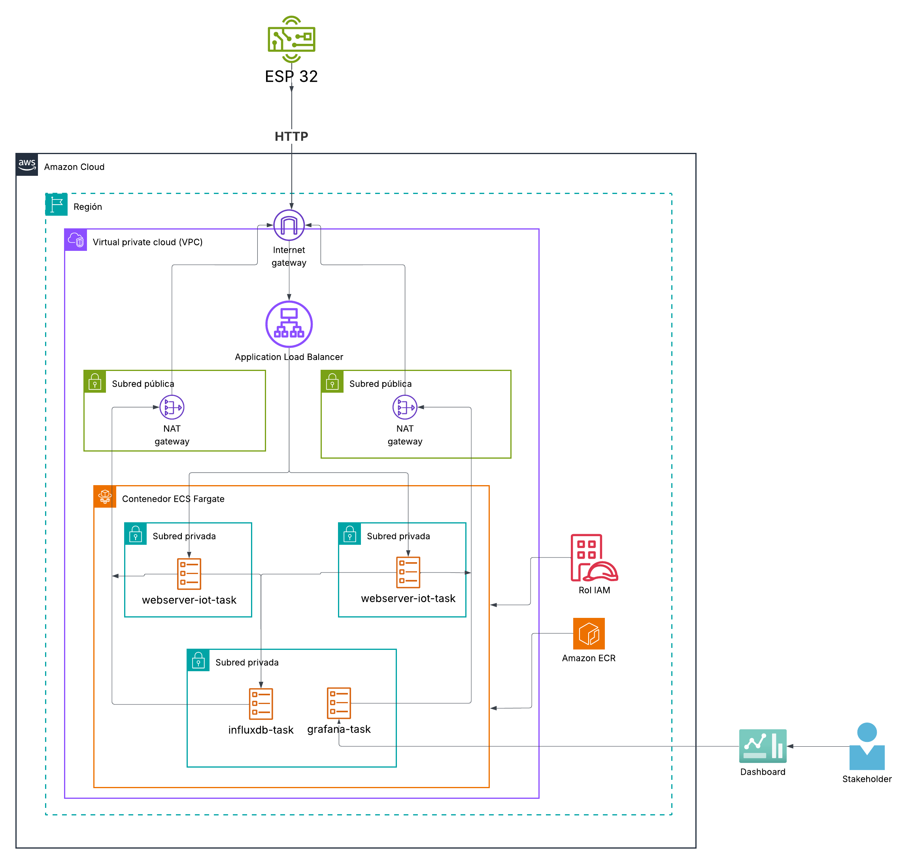

# 🌐 Serverless IoT Platform on AWS ECS Fargate

<div align="center">


**End-to-end IoT pipeline — from ESP32 sensor readings to real-time Grafana dashboards, running fully serverless on AWS.**

</div>

---

## 📋 Table of Contents

- [Overview](#-overview)
- [Architecture](#-architecture)
- [Tech Stack](#-tech-stack)
- [Project Structure](#-project-structure)
- [Data Flow](#-data-flow)
- [Infrastructure](#-infrastructure)
- [Web Server](#-web-server)
- [Getting Started](#-getting-started)
- [Key Design Decisions](#-key-design-decisions)

---

## 🔍 Overview

This project implements a **production-ready IoT data pipeline** where an ESP32 microcontroller sends temperature and humidity sensor readings to a Flask web server hosted on AWS ECS Fargate. The data is persisted in InfluxDB 3 (time-series database) and visualized in real-time through Grafana dashboards — all infrastructure provisioned as code with Terraform.

> 💡 **Portfolio highlight:** This project demonstrates end-to-end cloud engineering — IoT device integration, containerized microservices, infrastructure as code, network security, and observability.

---

## 🏗 Architecture


```
┌─────────────────────────────────────────────────────────────────┐
│                        Internet                                 │
└──────────────────────┬──────────────────────────────────────────┘
                       │
              ┌────────▼─────────┐
              │  Application     │
              │  Load Balancer   │  ← Single entry point
              │  (ALB)           │
              └──┬───────────┬───┘
                 │           │
    ┌────────────▼──┐   ┌────▼──────────────┐
    │  Web Server   │   │     Grafana        │
    │  Flask/Python │   │   (Dashboard)      │
    │  Port 5000    │   │   Port 3000        │
    │  Private Sub. │   │   Public Subnet    │
    └───────┬───────┘   └────────┬───────────┘
            │                    │
            │    ┌───────────────┘
            │    │   Service Discovery (db.local)
            └────▼────┐
            │ InfluxDB │
            │  3 Core  │  ← Isolated private subnet
            │ Port 8181│
            └──────────┘

 ESP32 ──► ALB ──► Web Server ──► InfluxDB
 Stakeholders ──► ALB ──► Grafana ──► InfluxDB
```


### Network Layout

```
VPC 10.0.0.0/16
├── 🌐 Public Subnet A  (10.0.1.0/24)  us-east-1a  → ALB, Grafana
├── 🌐 Public Subnet B  (10.0.3.0/24)  us-east-1b  → ALB, Grafana
├── 🔒 Private Subnet A (10.0.2.0/24)  us-east-1a  → Web Server
├── 🔒 Private Subnet B (10.0.4.0/24)  us-east-1b  → Web Server
└── 🔐 Private Subnet AA(10.0.5.0/24)  us-east-1a  → InfluxDB (isolated)
```

---

## 🛠 Tech Stack

| Layer | Technology | Purpose |
|---|---|---|
| **IoT Device** | ESP32 | Temperature & humidity sensing |
| **API Server** | Python + Flask | Receive sensor data via HTTP POST |
| **Time-Series DB** | InfluxDB 3 Core | Store sensor measurements |
| **Visualization** | Grafana Enterprise | Real-time dashboards |
| **Container Runtime** | AWS ECS Fargate | Serverless container execution |
| **Container Registry** | AWS ECR | Docker image storage |
| **Load Balancer** | AWS ALB | Traffic routing & health checks |
| **Service Discovery** | AWS Cloud Map | Internal DNS (`influxdb-core.db.local`) |
| **Observability** | AWS CloudWatch | Container logs |
| **IaC** | Terraform | Full infrastructure provisioning |
| **State Backend** | AWS S3 (native locking) | Remote Terraform state with locking |
| **IAM** | AWS IAM | Least-privilege task execution roles |

---

## 📁 Project Structure

```
ecs-serverless-iot/
│
├── 📂 infrastructure/              # Terraform IaC
│   ├── providers.tf                # AWS provider + default tags
│   ├── variables.tf                # Input variables
│   ├── backend.tf                  # S3 remote state config
│   ├── network.tf                  # VPC, subnets, IGW, NAT gateway
│   ├── alb.tf                      # Application Load Balancer
│   ├── security-groups.tf          # Security groups per service
│   ├── cluster-ecs.tf              # ECS cluster, task defs, services
│   ├── service-discovery.tf        # Cloud Map namespace & services
│   ├── iam.tf                      # Task execution roles & policies
│   └── outputs.tf                  # ALB DNS, cluster name
│
├── 📂 s3-backend-remote/           # Bootstrap remote state infra
│   ├── main.tf                     # S3 bucket with versioning, encryption & public access block
│   ├── variables.tf
│   └── outputs.tf
│
├── 📂 web-server/                  # Flask API container
│   ├── server-iot.py               # Main application
│   ├── Dockerfile                  # Container definition
│   ├── requirements.txt            # Python dependencies
│   ├── .dockerignore
│   └── .env                        # Local dev environment vars
│
├── 📂 esp32-client/                # ESP32 firmware
│   └── credentials.h               # WiFi & server credentials
│
├── 📂 task definition/             # ECS task definition JSONs
│   ├── grafana/
│   ├── influxdb/
│   └── web-server-IoT/
│
└── .gitignore
```

---

## 🔄 Data Flow

```
1. 🌡️  ESP32 reads DHT sensor  →  { "temperature": 24.5, "humidity": 61.2 }
        │
        ▼
2. 📡  HTTP POST /data  →  ALB  →  Web Server (Flask)
        │
        ▼
3. 🐍  Flask processes payload
       ├── Saves to CSV (local backup)
       └── Writes to InfluxDB via influxdb3-python client
               Point("values_sensor")
                 .tag("device", "esp32-home")
                 .field("temperature", 24.5)
                 .field("humidity", 61.2)
        │
        ▼
4. 📊  Grafana queries InfluxDB  →  Real-time dashboard
```

---

## ☁️ Infrastructure

### ECS Services

| Service | Subnet | Desired Count | Port |
|---|---|---|---|
| `webserver-iot-service` | Private A/B | 2 | 5000 |
| `influxdb-service` | Private AA (isolated) | 1 | 8181 |
| `grafana-service` | Public A/B | 1 | 3000 |

### Security Groups

```
ALB SG          → accepts port 80 from 0.0.0.0/0
webserver-iot SG → accepts port 5000 from ALB SG
grafana SG       → accepts port 3000 from ALB SG
db SG            → accepts port 8181 from webserver-iot SG + grafana SG only
```

InfluxDB is **never reachable from the internet** — only internal services can access it via the private subnet security group rules.

### Remote State

Infrastructure state is stored remotely in S3 using native S3 locking (`use_lockfile = true`), available since Terraform 1.10. This prevents concurrent state corruption without needing a DynamoDB table.

```bash
# Bootstrap the remote state first
cd s3-backend-remote
terraform init && terraform apply

# Then deploy the main infrastructure
cd ../infrastructure
terraform init && terraform apply
```

---

## 🐍 Web Server

The Flask API exposes three endpoints:

| Method | Endpoint | Description |
|---|---|---|
| `GET` | `/` | Health check index |
| `POST` | `/data` | Receive sensor JSON payload |
| `GET` | `/health` | ALB health check target |

**Sensor payload format:**
```json
{
  "temperature": 24.5,
  "humidity": 61.2
}
```

The server writes each reading to InfluxDB using the `influxdb3-python` client with the `esp32-home` device tag, enabling per-device filtering in Grafana.

---

## 🚀 Getting Started

### Prerequisites

- AWS CLI configured with a valid profile
- Terraform >= 1.5
- Docker Desktop
- Python 3.12+

### 1. Bootstrap remote state

```bash
cd s3-backend-remote
terraform init
terraform apply
```

### 2. Deploy infrastructure

```bash
cd infrastructure
terraform init
terraform plan
terraform apply
```

### 3. Configure ESP32

Edit `esp32-Client/esp32-client/credentials.h` with your WiFi credentials:

```cpp
#define credentials

const char* ssid     = "YOUR_WIFI_SSID";
const char* password = "YOUR_WIFI_PASSWORD";
```

Then update the server address in `esp32-Client/esp32-client/esp32-client.ino` with the ALB DNS output from Terraform:

```cpp
const char* server = "<your-alb-dns>.us-east-1.elb.amazonaws.com";
```

> ⚠️ Replace the placeholder values with your real credentials before flashing the ESP32. Never push real credentials to a public repository.

### 4. Build & push web server image

```bash
aws ecr get-login-password --region us-east-1 | \
  docker login --username AWS --password-stdin \
  <account_id>.dkr.ecr.us-east-1.amazonaws.com

docker build -t web-server-iot ./web-server
docker tag web-server-iot:latest \
  <account_id>.dkr.ecr.us-east-1.amazonaws.com/web-server-iot:latest
docker push \
  <account_id>.dkr.ecr.us-east-1.amazonaws.com/web-server-iot:latest
```

---

## 🎯 Key Design Decisions

**InfluxDB in an isolated private subnet** — The time-series database has its own dedicated subnet (`10.0.5.0/24`) with a security group that only allows traffic from the webserver and Grafana. This follows the principle of least privilege at the network layer.

**AWS Cloud Map for internal service discovery** — Instead of hardcoding IPs (which change on every Fargate task restart), the webserver resolves InfluxDB at `influxdb-core.db.local:8181` via private DNS.

**Fargate for zero server management** — No EC2 instances to patch or manage. ECS Fargate handles capacity automatically.

**Terraform remote state on S3** — State is stored remotely in S3 with native S3 locking (`use_lockfile = true`, available since Terraform 1.10). No DynamoDB table required — the lock file is managed directly in the same S3 bucket, simplifying the backend setup.

**Default tags on every resource** — The AWS provider is configured with `default_tags` to ensure every resource is tagged with `Project`, `Environment`, and `ManagedBy = terraform`.

---

<div align="center">

Made with ☕ and a lot of `terraform apply`

</div>
